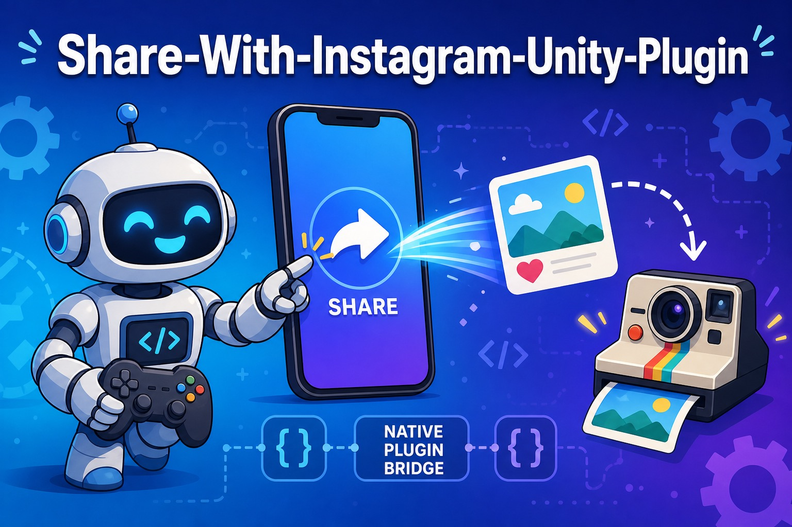

# Share-With-Instagram-Unity-Plugin

  -blue)  



A 2016-era iOS native plugin for Unity that opens the system share sheet (`UIActivityViewController`) to share text or an image — with a custom Instagram activity included — from Unity games. The repo also contains a standalone iOS sample app demonstrating the same Instagram-sharing flow with CocoaPods libraries.

> **Status: legacy.** Last updated in 2017, built against iOS 9-era APIs (`keyWindow`, CocoaPods 1.0.1) and Instagram's old document-interaction sharing. It will not work as-is on modern iOS/Instagram and is kept as a reference sample.

## Project Structure

| Path | Description |
|---|---|
| `UnityPlugin/` | Xcode project containing the Unity native plugin |
| `UnityPlugin/ShareWithInstagram/Unity Native Plugin/AlsoShareWithInstagram.mm` | The plugin entry points: `shareMessage(const char *)` and `shareImage(const char *imagePath, const char *message)`, exposed with C linkage for Unity's P/Invoke |
| `UnityPlugin/.../DMActivityInstagram/` | Bundled custom `UIActivity` that posts an image to Instagram |
| `ShareWithInstagram/` | Standalone iOS sample app (CocoaPods: `MGInstagram`, `PKImagePicker`) showing image pick → Instagram share |

## Usage (as designed)

1. Copy `Unity Native Plugin/` (including `DMActivityInstagram/`) into your Unity project's `Assets/Plugins/iOS/`.
2. From C#, declare and call the native functions:

   ```csharp
   [DllImport("__Internal")] private static extern void shareMessage(string message);
   [DllImport("__Internal")] private static extern void shareImage(string imagePath, string message);
   ```

3. Build for iOS; the functions present a share sheet from the root view controller.

The sample app under `ShareWithInstagram/` requires `pod install` (CocoaPods) and opening the generated `.xcworkspace`.

## Requirements

- Unity iOS build target (plugin code is Objective-C++)
- Xcode / iOS SDK of the era (circa 2016–2017)
- CocoaPods for the sample app only
